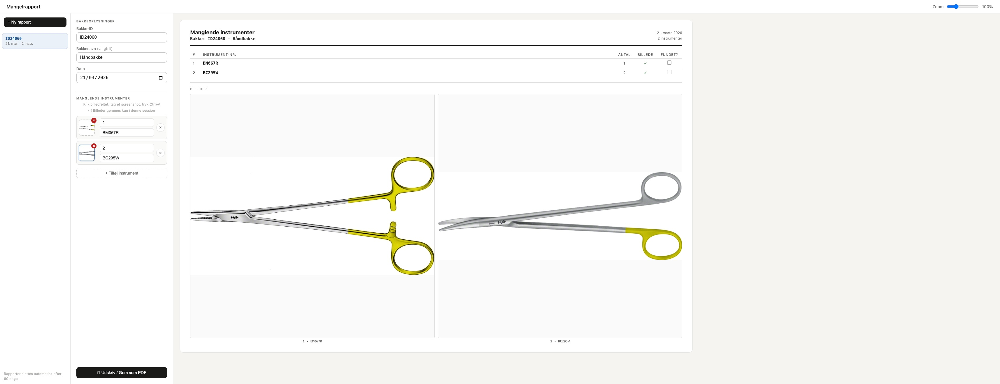

# Mangelrapport

Mangelrapport is a small Cloudflare Pages app for tracking missing instruments in repair trays.

In a sterile services department, instruments sometimes go missing from repair trays. Keeping track of which ones are missing — and where they should go back — used to mean juggling it mentally or on scraps of paper. This app gives the team a shared, visual overview with tray numbers, part numbers, and photos so everyone knows what to look out for.

The project started as a simple local-only single HTML file prototype. You can still see that early shape in `standalone/standalone.html`. It later became a web app so multiple people could work against the same shared database instead of separate local copies.

## Screenshot



## What it does

- create, edit, and delete reports
- add missing instruments and photos
- show a live print preview
- persist data through Cloudflare Pages Functions and Turso

## Project structure

- `public/` — the browser app and static assets
- `functions/api/` — Cloudflare Pages Functions
- `standalone/` — the original local-only prototype
- `screenshot/` — screenshot of the app
- `wrangler.toml` — Pages configuration

## Local development

1. Install dependencies:
   ```bash
   npm install
   ```
2. Set the required environment variables for the Functions:
   - `TURSO_URL`
   - `TURSO_TOKEN`
3. Start the local Pages dev server:
   ```bash
   npm run dev
   ```

## Deployment

Deploy the `public/` directory as a Cloudflare Pages project and set the same Turso environment variables in Pages.

The main app shell lives in `public/mangel-rapport.html`.
