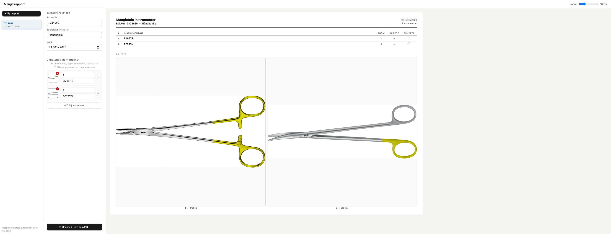

# Mangelrapport

Mangelrapport is a browser-based app for tracking missing instruments in repair trays.

It gives a shared overview of reports, tray details, part numbers, and photos so the team can keep track of what is missing without relying on scattered notes or separate local files.

The project grew out of a local-only prototype. You can still see the original single-file shape in `standalone/standalone.html`. The current app is a shared web app backed by Cloudflare Pages Functions and Turso.

## Screenshot



## What it does

- create, edit, and delete reports
- add missing instruments and photos
- show a live print preview
- persist data through Cloudflare Pages Functions and Turso
- warn when the current session has expired

## Project structure

- `public/` — browser app and static assets
- `functions/api/` — Cloudflare Pages Functions
- `standalone/` — original local-only prototype
- `screenshot/` — app screenshot
- `wrangler.toml` — Cloudflare Pages configuration

## Local development

1. Install dependencies:
   ```bash
   npm install
   ```
2. Set the required environment variables for the Functions:
   - `TURSO_URL`
   - `TURSO_TOKEN`
3. Start the local Pages dev server:
   ```bash
   npm run dev
   ```

## Deployment

Deploy the `public/` directory as a Cloudflare Pages project and set the same Turso environment variables in Pages.

The main app shell lives in `public/mangel-rapport.html`.
